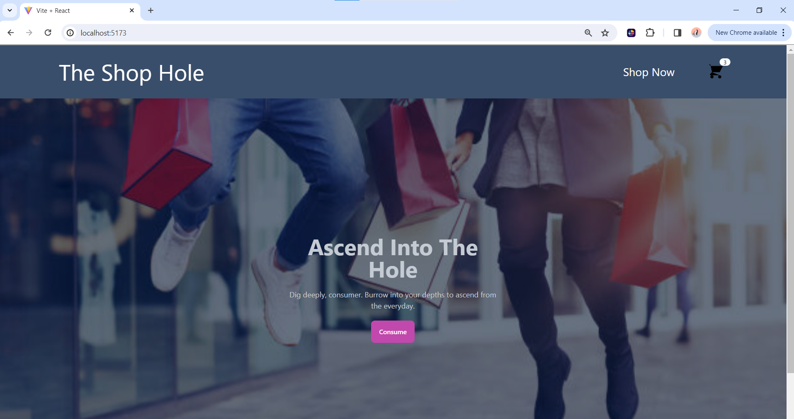
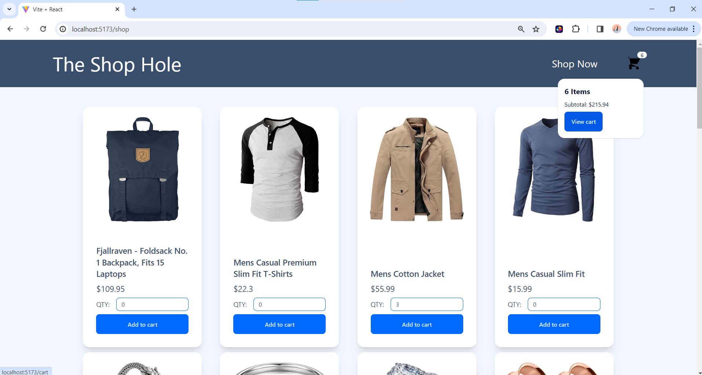
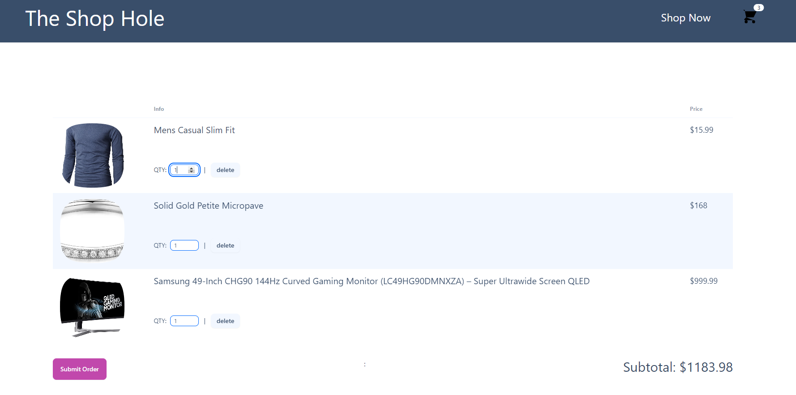

# React Shopping Cart 
Odin Project exercise. Mini Ecommerce platform with homepage, products page, and cart. Has ability to navigate between pages, add/remove items from cart, and check out with accurate total cost. The focus was to understand API calls, React Router, and state management with the Context API.

## Install Locally
1. Clone the repo with `git clone [url]`
2. `cd` into the project directory
3. Run `npm install` to install dependencies
4. Run `npm run dev` and open it in the browser.

## Technology Stack
* Frontend framework: React.js
* Style Libraries: DaisyUI
* Build tool: Vite
* Host: Netlify

## Screenshots

---

---

